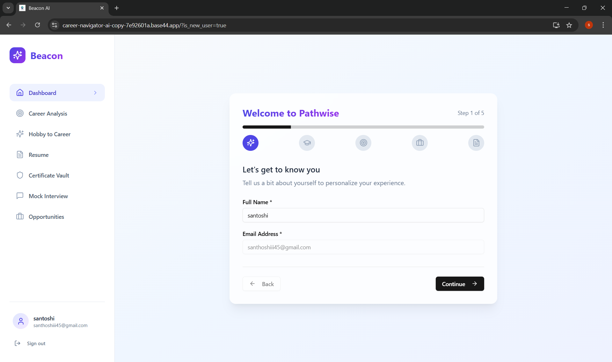
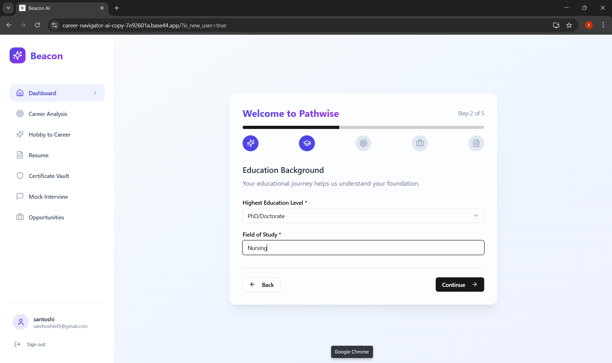
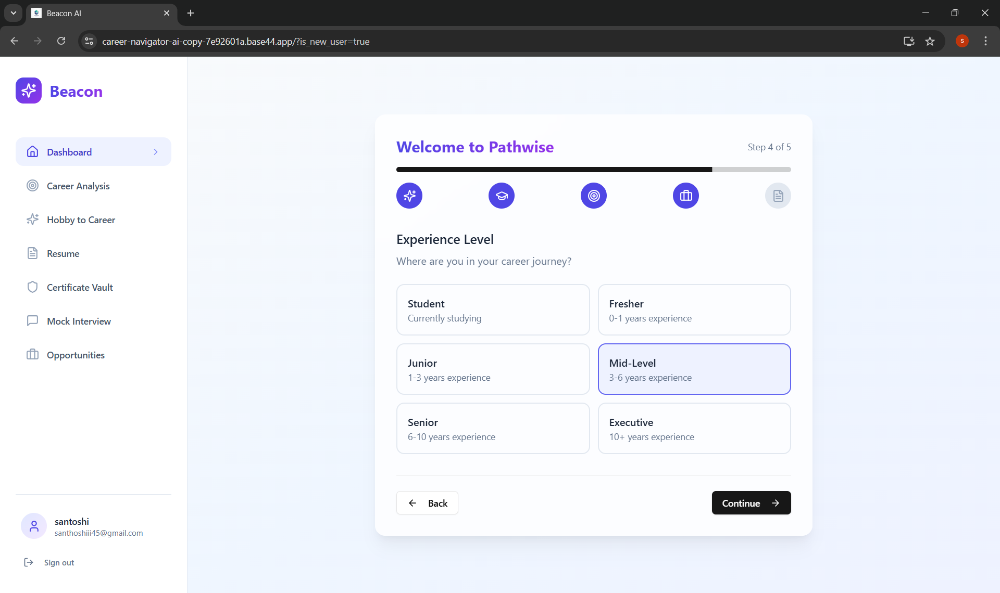
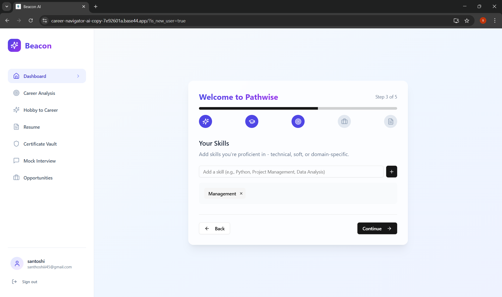
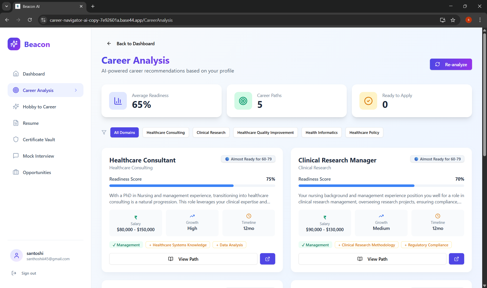
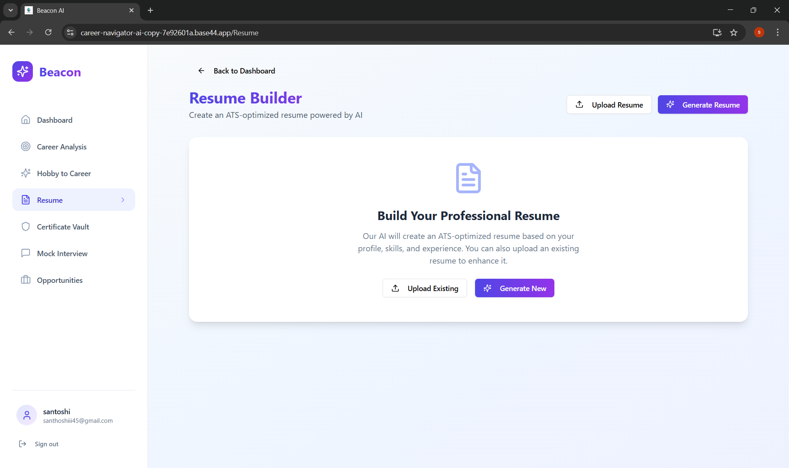
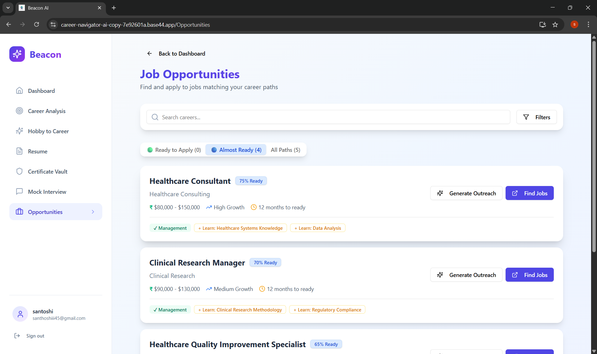
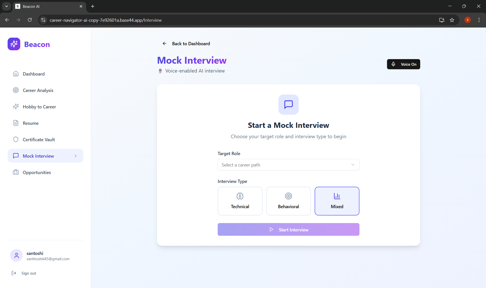

# 🏆 Beacon — AI-Powered Career Discovery & Readiness Platform

> Beacon is a secure, AI-powered career discovery and readiness platform that helps users understand their career fit, verify credentials, build professional resumes, prepare through voice-based mock interviews, and apply to real job opportunities — all in one guided experience.

🚀 Built for an **Agentic AI Hackathon** with a strong focus on **security, explainability, and real-world usability**.

👉 **Live App:** https://career-navigator-ai-copy-7e92601a.base44.app

## 📌 Problem Statement

Students and early professionals often struggle to make informed career decisions due to:

- Lack of clarity on which career paths truly match their skills, education, and interests  
- No clear way to measure **career readiness**  
- Fragmented tools for resumes, learning, interviews, and job discovery  
- No reliable mechanism to **verify certificates and credentials**  
- Growing concerns around **data privacy and security**

Most existing platforms solve only isolated parts of this problem, leaving users without a **secure, end-to-end career guidance system**.

---

## 💡 Our Solution

**Beacon** addresses this problem by providing a **unified, secure, and intelligent career platform** that:

- Analyzes user profiles across **all career domains (not just tech)**
- Verifies certificates and credentials in a secure vault
- Evaluates career readiness using explainable AI
- Builds **ATS-friendly, real-world resumes (PDF)**
- Guides users with personalized learning paths
- Prepares users through **1-on-1 voice-based AI mock interviews**
- Connects users to **real job opportunities** when they are ready

All decisions are transparent, actionable, and user-controlled.

---

## ✨ Key Features

### 🔐 Security-First Design
- Password-protected certificate vault
- Encrypted file storage (no public URLs)
- Auto-lock after inactivity
- Time-limited signed URLs for document access
- No plaintext storage of sensitive files

---

### 🗄️ Certificate Vault & Verification
- Upload certificates (PDF / JPG / PNG)
- Verification status:
  - ✅ Verified
  - ⚠️ Uploaded (Unverified)
  - ❌ Potentially Forged
- Certificate metadata tracking (institution, year, type)
- Verification impacts career readiness analysis

---

### 📄 AI Resume Builder (PDF Export)
- Builds **professional, ATS-friendly resumes**
- Auto-fills education from verified certificates
- Role-aligned resume optimization
- One-click **PDF download**
- Resume intelligence reused across career analysis

---

### 🧭 Career Explorer (All Domains)
Supports careers across **multiple domains**, including:
- Technology & IT
- Healthcare
- Finance & Banking
- Education
- Engineering
- Creative & Design
- Business & Management
- Legal
- Government & Public Sector
- Manufacturing
- Media & Communications
- Hospitality & Tourism

Each career includes:
- Readiness score (0–100)
- Eligibility zone
- Salary range
- Growth outlook
- Skill gaps
- Timeline to job readiness

---

### 🎯 Career Readiness Zones
- 🟢 **Apply Now** (80%+ ready)
- 🔵 **Almost Ready** (60–79%)
- 🟡 **Growth Needed** (40–59%)
- 🟣 **Explore** (<40%)

Each zone comes with **clear, actionable next steps**.

---

### 📚 Personalized Learning Paths
- Beginner → Intermediate → Advanced roadmaps
- Timeline-based skill progression
- Real learning resources:
  - YouTube
  - Coursera
  - Udemy
  - freeCodeCamp
  - Microsoft Learn

---

### 💼 Opportunities Hub
- Shows only **ready-to-apply careers**
- Real LinkedIn job search links
- AI-generated outreach email drafts
- User-controlled applications (no automation or spam)

---

### 🎙️ 1-on-1 AI Mock Interview (Voice-Based)
- AI interviewer asks questions using voice
- User responds via voice
- Follow-up questions in real time
- Interview score and detailed feedback on:
  - Confidence
  - Fluency
  - Clarity
  - Communication
  - Technical depth

---

### 🤖 AI Career Assistant
- Chatbot for:
  - Career guidance
  - Resume improvement
  - Interview preparation
  - Learning advice
- Context-aware and always responsive

---

### 📊 Dashboard & Visual Insights
- Profile completeness tracking
- Career readiness charts
- Skill distribution graphs
- Quick access to:
  - Certificate vault
  - Resume
  - Career explorer
  - Opportunities hub

---

## 🧱 System Architecture (High Level)

User
  → Secure UI (Base44)
  → Profile & Certificate Vault
  → Multi-Agent AI Layer
  → Career, Resume & Interview Intelligence
  → Learning Resources & Job Opportunities

## 🖼️ Screenshots

### Login

### Education Background

### Experience Level

### Skills Selection

### Career Analysis

### Certificate Vault

### Resume Builder

### Job Opportunities

### Mock Interview

